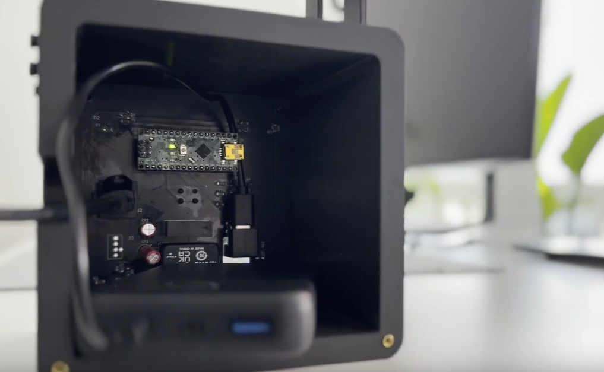

# DIY-Fan-V1

Files from the YouTube video:  
**"DIY Fan V1 – I Built This Modular Open Source Project"**

https://www.youtube.com/watch?v=IbPePFFd2lk

## Project structure

- **ECAD/** – KiCad files  
- **CODE/** – Arduino code  
- **CAD/** – 3D models (STL, STEP)
- **BOM/** – Each assembly has its own BOM, organized in separate worksheets within a single .ods file (Assembly_Fan-Stage, Assembly_MainPCBA-Housing and Assembly_Tripod)

## License

This project is open source and licensed as follows:

- **ECAD:** CERN Open Hardware License v2.0  
- **CODE:** MIT License  
- **CAD:** Creative Commons Attribution 4.0 (CC BY 4.0)

➡️ For full license texts, see the [LICENSE](LICENSE) file.

## Story

I came up with the idea to develop a modular, battery-powered, open-source fan built around high-end gaming PC fans. Gaming PC fans have low power consumption and, in the best case, are very quiet. Both are qualities that are also useful when the goal is not to cool PC components, but people. Additionally, the goal was to create a visually appealing and functional design.

The result is a system with three main assemblys: 

**1. FAN Stage:**

- The Fan Stage assembly, in turn, consists of three components: the fan, the interface_V1 PCBA, and the shroud.
- As for the fan, I chose the Noctua **NF-A12x25 PWM chromax.black.swap**. This fan offers a good balance of airflow and static pressure.
- It is possible to use other fans as well. However, they should have similar characteristics, such as comparable power consumption and static pressure.
- Using **the shroud increases the wind speed by around 80%**, which means the device can be placed a bit further away while still staying effective. Check it out in the linked YouTube video! :)
- In addition, the interface_V1 PCBA is installed on the side. The PC fan can be connected to this board, which then passes on the fan’s signals.

**2. Main Electronics Module:**

- The electronics module provides approximately **10W** of power. When using fans such as the Noctua NF-A12x25 PWM chromax.black.swap, as I do, up to five fan stages can be operated simultaneously.
- Operation is handled via a single **button**, which allows the PWM levels to be cycled through sequentially.
- Four **RGB LEDs** visible through the plexiglass panel indicate which PWM level is currently active.

- The **Arduino Nano** was just the right choice for this project – it’s compact and super easy to work with thanks to the Arduino IDE. Plus, using an Arduino makes it way easier for others to recreate the build, especially if you’ve played around with Arduinos before. The Nano sits on a small custom PCB to hook up a few extra parts – like some LEDs, a DC-DC converter, and one or two other small parts. But don’t worry: the number of components is totally manageable. So go ahead and give it a shot!
- Also visible is a **15W power bank**. I chose a power bank instead of a custom-built battery to make the project easier to replicate. Nowadays, power banks are quite affordable and can also be used for other purposes beyond the DIY Fan.

**3. Tripod:**

- There isn't much to say about the tripod. If the legs are cut cleanly, the DIY fan stands level. In any case, the tripod provides the necessary stability, and in my opinion, the wood finish gives the device a better look.

The goal was, among other things, to develop a **modular system**. To achieve this, the three assemblies can be combined in various **configurations**. They are connected using **mechanical connectors** and standard **Ethernet cables**. The Ethernet cables transmit both the power supply and the PWM signal. Below are the setups demonstrated in the YouTube video:

**Full Build (with 3/5 Fans)**

**Desk Setup**

**Split Mode (Left and Right → Stereo)**

