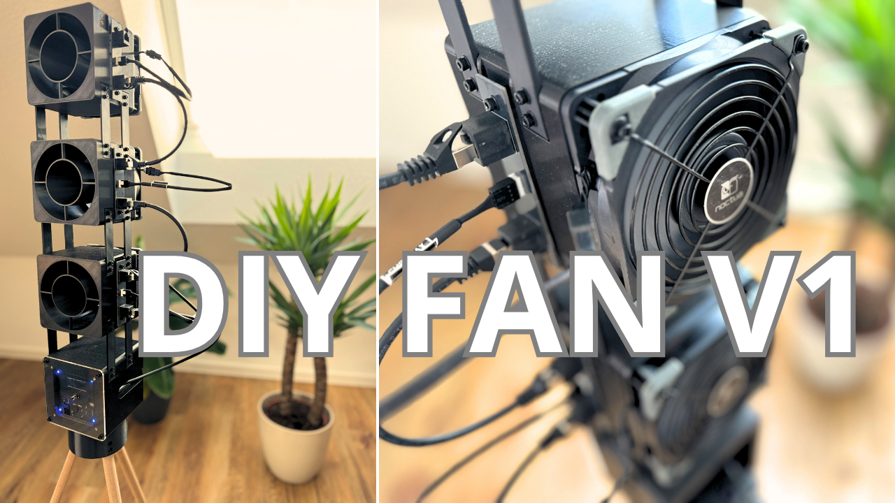

# DIYFAN_V1

Files from the YouTube video:  
**"DIY FAN V1 | Even BETTER than Noctua's desk fan?"**

## Project structure

- **ECAD/** – KiCad files  
- **CODE/** – Arduino code  
- **CAD/** – 3D models (STL, STEP)
- **BOM** – Each assembly has its own BOM, organized in separate worksheets within a single file (Assembly_Fan-Stage, Assembly_Electronic-Stage and Assembly_Tripod)

## License

This project is open source and licensed as follows:

- **ECAD:** CERN Open Hardware License v2.0  
- **CODE:** MIT License  
- **CAD:** Creative Commons Attribution 4.0 (CC BY 4.0)

➡️ For full license texts, see the [LICENSE](LICENSE) file.
